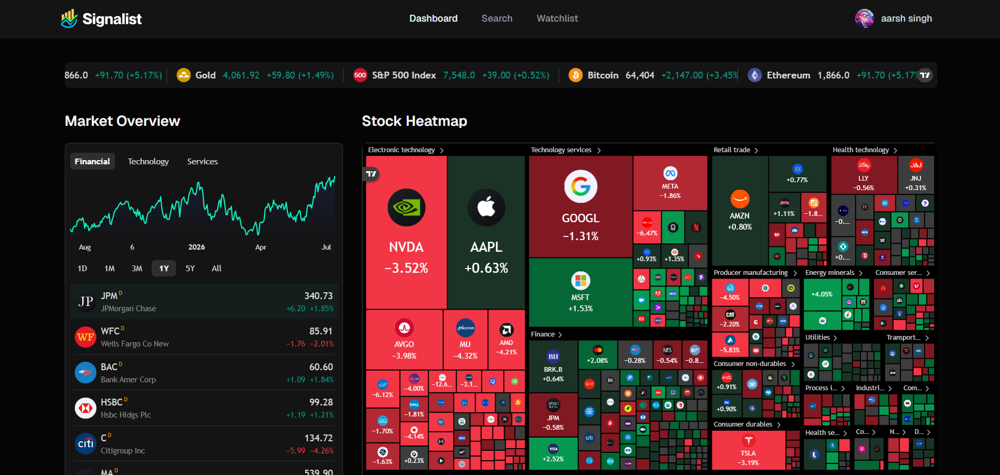
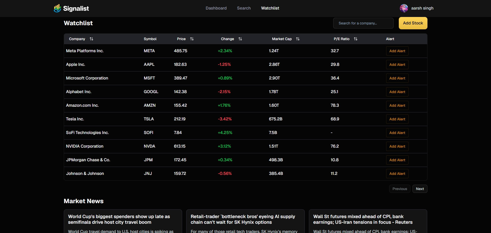
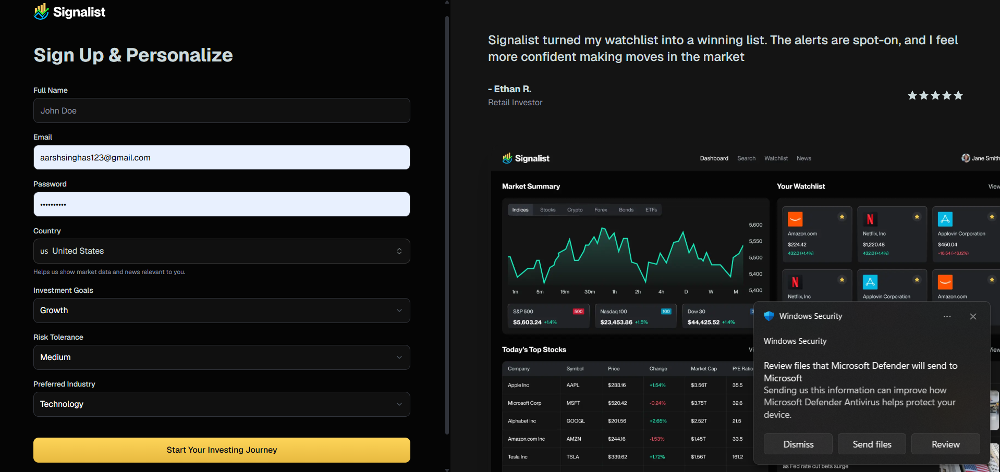
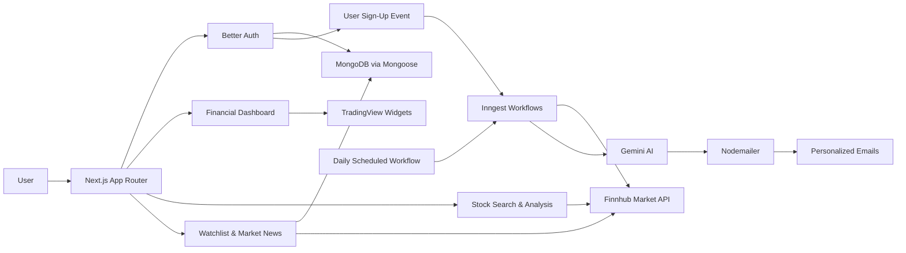

# 📈 Signalist — AI-Powered Stock Market Intelligence Platform


Signalist is a full-stack stock-market intelligence platform built with Next.js, TypeScript, MongoDB, and AI-powered background workflows.

It combines interactive market dashboards, stock discovery, dynamic company analysis, personalized onboarding, financial news, watchlist experiences, and automated email workflows in one responsive application.

- Built secure authentication and protected financial dashboards with Better Auth
- Integrated TradingView widgets for interactive market visualization and stock analysis
- Connected Finnhub APIs for stock discovery and financial news
- Developed AI-personalized onboarding and scheduled market-news emails using Gemini, Inngest, and Nodemailer

------------------------------------------------------------------------

## 🌐 Live Demo

https://aarsh-signalist.vercel.app/

------------------------------------------------------------------------

## ✨ Why This Project Stands Out

- Full-stack financial platform built with the Next.js App Router
- Secure MongoDB-backed authentication and protected application routes
- Interactive market dashboards and dynamic stock-analysis pages powered by TradingView
- Real stock discovery and financial news through Finnhub APIs
- AI-personalized onboarding based on user investment preferences
- Event-driven and scheduled workflows using Inngest, Gemini, and Nodemailer
- Responsive financial interface designed for desktop and mobile devices

------------------------------------------------------------------------

## 📸 Screenshots

### 📊 Interactive Market Dashboard

<p align="center">
  
</p>

> Explore market performance through TradingView charts, financial indicators, ticker data, market quotes, and a sector-based stock heatmap.

---

### ⭐ Stock Watchlist & Market News

<p align="center">
  
</p>

> Track companies through a structured financial table with prices, performance indicators, market data, alert interfaces, and financial news.

---

### 🔐 Personalized User Onboarding

<p align="center">
  
</p>

> Create a personalized investment profile by selecting a country, investment goals, risk tolerance, and preferred industry.

------------------------------------------------------------------------

## 🧠 Core Features

### 🔐 Authentication & Personalized Onboarding

- Secure email and password authentication using Better Auth
- MongoDB-backed user accounts and authenticated sessions
- Protected application routes with automatic authentication redirects
- Personalized onboarding based on country, investment goals, risk tolerance, and preferred industry

### 📊 Interactive Market Dashboard

- Live market ticker, market overview charts, financial quotes, and market timeline
- Sector-based stock heatmap and market-performance visualization
- Responsive TradingView widgets for interactive financial insights

### 🔎 Stock Discovery & Analysis

- Debounced command-style search by company name or ticker symbol
- Popular stock suggestions with exchange and security information
- Keyboard shortcut support using `Ctrl/Cmd + K`
- Direct navigation to dynamic company-analysis pages
- Interactive charts, technical indicators, company profiles, and financial data

### ⭐ Watchlist & Financial News

- Structured watchlist with company information, prices, percentage changes, market capitalization, and P/E ratios
- Search, sorting, pagination, and stock-alert interfaces
- General and company-specific financial news powered by Finnhub
- Watchlist-aware news retrieval with validation, duplicate filtering, and fallback market news

### ✉️ AI-Powered Email Workflows

- Inngest triggers a personalized welcome workflow after registration
- Gemini generates onboarding content using the user's investment preferences
- Scheduled workflows retrieve users, watchlist symbols, and relevant Finnhub news
- Gemini converts market updates into personalized summaries delivered through Nodemailer

------------------------------------------------------------------------

## 🛠️ Tech Stack

| Category | Technologies |
| --- | --- |
| **Frontend** | Next.js 15 · React 19 · TypeScript · Tailwind CSS 4 |
| **UI & Forms** | shadcn/ui · Radix UI · Lucide React · React Hook Form · Zod |
| **Authentication** | Better Auth · MongoDB Adapter |
| **Database** | MongoDB · Mongoose |
| **Market Data** | Finnhub API · TradingView Widgets |
| **AI & Workflows** | Gemini AI · Inngest |
| **Email & Utilities** | Nodemailer · Gmail SMTP · TanStack React Table · Sonner |
| **Deployment** | Vercel |

------------------------------------------------------------------------

## 🏗️ Architecture Overview



------------------------------------------------------------------------

## ⚡ Challenges & Learnings

- Integrated Better Auth with MongoDB and protected Next.js App Router layouts
- Managed authentication and data flow across server and client components
- Built dynamic stock discovery with debounced Finnhub API requests and fallback handling
- Integrated multiple TradingView widgets with symbol-specific configurations
- Created event-driven and scheduled workflows using Inngest, Gemini, and Nodemailer
- Resolved hydration, third-party component, environment configuration, and deployment issues

------------------------------------------------------------------------

## 🚧 Future Improvements

- Complete persistent watchlist add-and-remove functionality with user-specific market data
- Implement stock-alert creation, management, automated price monitoring, and email notifications
- Add advanced stock filters, company comparisons, and portfolio-performance tracking
- Introduce automated integration and workflow testing

------------------------------------------------------------------------

## 📦 Project Structure

```text
Signalist/
├── app/
│   ├── (auth)/
│   │   ├── sign-in/
│   │   └── sign-up/
│   ├── (root)/
│   │   ├── stocks/
│   │   └── watchlist/
│   └── api/
│       ├── auth/
│       └── inngest/
│
├── components/
│   ├── ui/
│   ├── Header.tsx
│   ├── SearchCommand.tsx
│   ├── WatchlistButton.tsx
│   └── WatchlistTable.tsx
│
├── database/
│   ├── models/
│   └── mongoose.ts
│
├── hooks/
│   └── useDebounce.ts
│
├── lib/
│   ├── actions/
│   ├── better-auth/
│   ├── inngest/
│   ├── nodemailer/
│   ├── constants.ts
│   ├── schemas.zod.ts
│   └── utils.ts
│
├── public/
│   ├── assets/
│   └── screenshots/
│       ├── dashboard.png
│       ├── watchlist.png
│       └── signup.png
│
├── types/
│   └── global.d.ts
│
├── next.config.ts
├── package.json
└── tsconfig.json
```

------------------------------------------------------------------------

## 👔 Recruiter Snapshot

- Built and deployed a full-stack financial intelligence platform using Next.js, React, TypeScript, and MongoDB
- Implemented secure authentication and protected application routes with Better Auth
- Integrated TradingView and Finnhub for interactive market visualization, stock discovery, analysis, and financial news
- Developed AI-personalized onboarding and scheduled market-news workflows using Gemini and Inngest
- Implemented automated email delivery with Nodemailer and deployed the application on Vercel
- Demonstrated experience across frontend development, authentication, databases, APIs, AI workflows, background jobs, and cloud deployment
